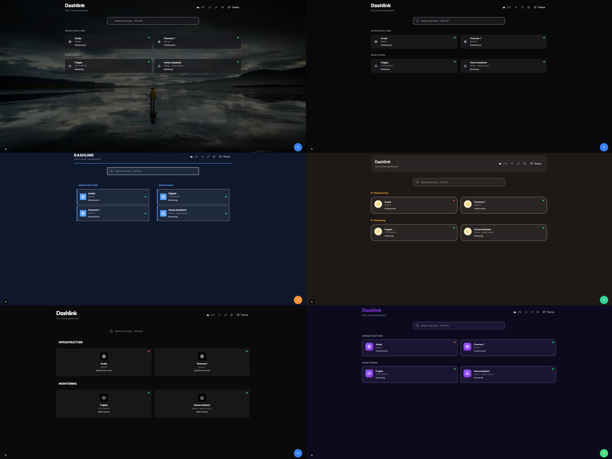
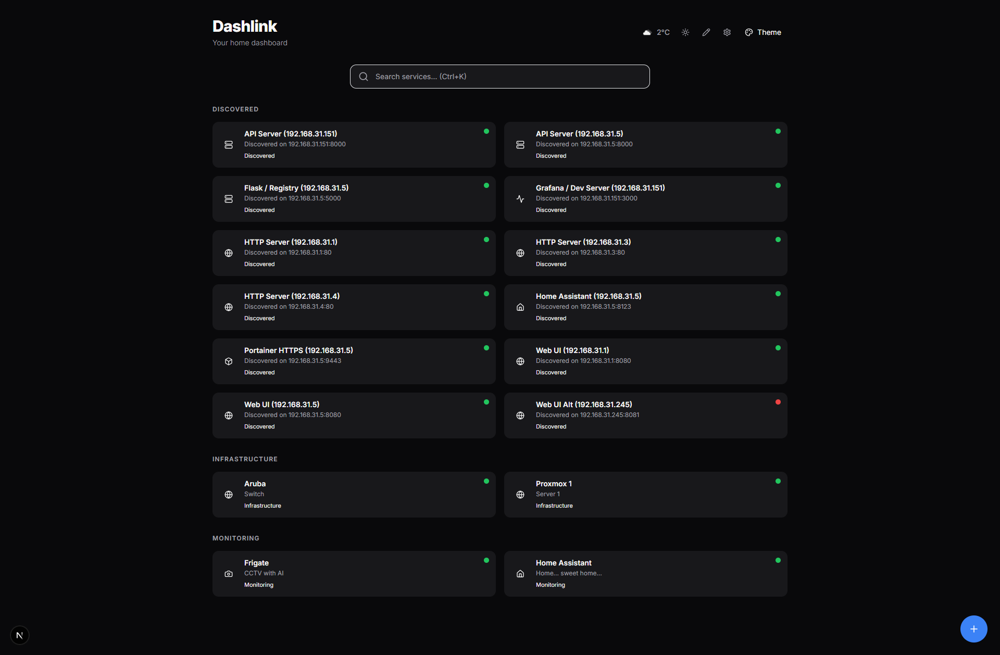
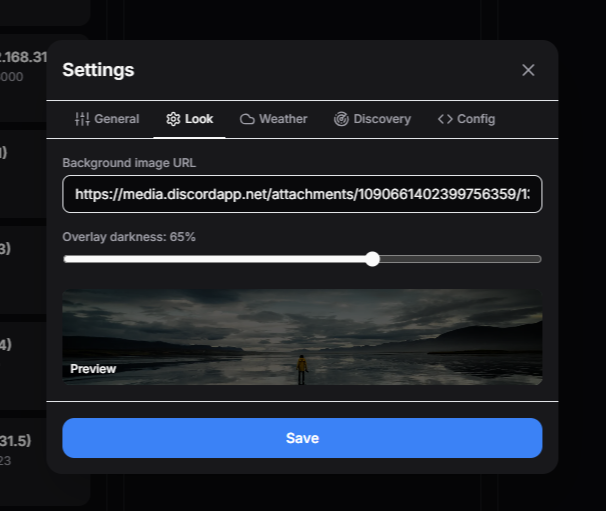
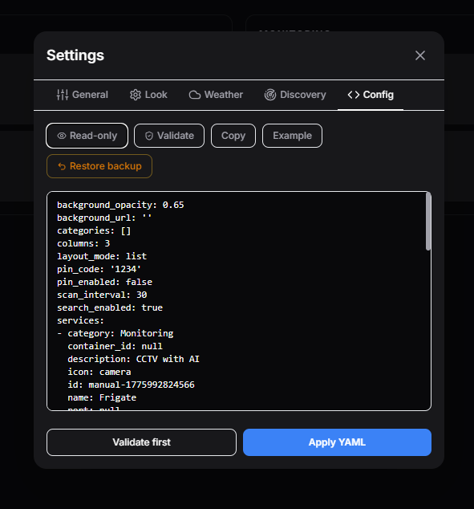

<p align="center">
  
</p>

<h1 align="center">Dashlink</h1>

<p align="center">
  <strong>A modern, self-hosted dashboard that auto-discovers your Docker services.</strong>
</p>

<p align="center">
  <a href="#quick-start"></a>
  <a href="https://github.com/Vatsonio/dashlink/releases"></a>
  <a href="https://github.com/Vatsonio/dashlink/blob/main/LICENSE"></a>
  <a href="https://github.com/Vatsonio/dashlink/stargazers"></a>
</p>

<p align="center">
  <a href="#features">Features</a> &bull;
  <a href="#quick-start">Quick Start</a> &bull;
  <a href="#themes">Themes</a> &bull;
  <a href="#configuration">Configuration</a> &bull;
  <a href="#comparison">Comparison</a> &bull;
  <a href="#deployment">Deployment</a>
</p>

<br />

<p align="center">
  
</p>

---

## Why Dashlink?

You spin up a dozen Docker containers - Grafana, Portainer, Jellyfin, Pi-hole - and suddenly you're bookmarking `192.168.1.x:PORT` everywhere. **Dashlink fixes that.**

It auto-discovers your running Docker containers, monitors their health in real-time, and presents everything in a beautiful, searchable dashboard. No manual YAML editing required.

## Features

| | Feature | Description |
|:--|:--------|:------------|
| **Auto-Discovery** | Docker & Network | Detects running containers via Docker socket. Scans your LAN for services. Zero config. |
| **Health Monitoring** | Real-time | Live status checks - see which services are up, down, or slow. |
| **Themes** | 5 built-in | Switch instantly from the UI. Glassmorphism, violet, flat, modern, warm. |
| **Custom Background** | Any image | Set any photo as your dashboard wallpaper via the Look tab. |
| **Quick Search** | `Ctrl+K` | Instantly find any service. |
| **Config UI** | In-browser | Add services, change settings, trigger discovery - no terminal needed. |
| **YAML Config** | GitOps-ready | `config.yml` for version control and backup. |
| **Docker Labels** | Per-container | Customize name, icon, category, URL with simple labels. |
| **PIN Protection** | Optional | Lock your dashboard with a PIN code. |
| **Auto-HTTPS** | Caddy | Automatic Let's Encrypt certificates. |
| **Lightweight** | ~50MB image | Fast startup. Minimal resources. |

<p align="center">
  
</p>

## Quick Start

```bash
docker compose up -d
```

That's it. Open [http://localhost](http://localhost).

<details>
<summary><strong>Full setup with HTTPS</strong></summary>

```bash
git clone https://github.com/Vatsonio/dashlink.git
cd dashlink
cp .env.example .env    # edit DOMAIN=yourdomain.com
docker compose up -d
```

Caddy automatically provisions HTTPS via Let's Encrypt.

</details>

<details>
<summary><strong>Development</strong></summary>

```bash
docker compose -f docker-compose.dev.yml up --build
```

| Service | URL |
|:--------|:----|
| Frontend | [http://localhost:3000](http://localhost:3000) |
| API | [http://localhost:8000](http://localhost:8000) |
| Swagger | [http://localhost:8000/docs](http://localhost:8000/docs) |

</details>

## Themes

Dashlink ships with **5 hand-crafted themes** - switch instantly from the UI.

| Theme | Style | Vibe |
|:------|:------|:-----|
| **Violet Marketplace** | Bold gradients, rounded cards | Energetic, youthful (default) |
| **Trust Teal** | Glassmorphism, frosted glass | Elegant, premium |
| **Clean Flat** | No shadows, solid colors | Minimal, fast |
| **Geometric Modern** | Swiss grid, high contrast | Architectural, serious |
| **Soft & Warm** | Soft shadows, warm tones | Cozy, inviting |

You can also **set any image as your dashboard background** via the Look tab:

<p align="center">
  
</p>

## Docker Labels

Customize how containers appear on the dashboard:

```yaml
services:
  grafana:
    image: grafana/grafana
    labels:
      - "dashlink.name=Grafana"
      - "dashlink.icon=activity"
      - "dashlink.category=Monitoring"
      - "dashlink.description=Metrics & dashboards"
      - "dashlink.url=http://localhost:3000"
      - "dashlink.hide=false"
```

| Label | Description | Default |
|:------|:------------|:--------|
| `dashlink.name` | Display name | Container name |
| `dashlink.icon` | Icon name ([Lucide](https://lucide.dev/icons)) | Auto-detected |
| `dashlink.category` | Group category | `Docker` |
| `dashlink.description` | Short description | - |
| `dashlink.url` | Override URL | Auto-detected from ports |
| `dashlink.hide` | Hide from dashboard | `false` |

**Auto-detected icons:** Portainer, Grafana, Prometheus, Nginx, Traefik, Pi-hole, Jellyfin, Plex, Sonarr, Radarr, Nextcloud, Gitea, GitLab, Home Assistant, Vaultwarden, Uptime Kuma, AdGuard, and more.

## Configuration

### Via UI

Click the **Settings** icon in the top-right corner to change title, subtitle, grid columns, theme, PIN protection, scan interval, and more.

<p align="center">
  
</p>

### Via YAML

Edit `/data/config.yml` (mounted as a Docker volume):

```yaml
title: Dashlink
subtitle: My homelab
theme: violet-marketplace
columns: 4
docker_discovery: true
search_enabled: true
scan_interval: 30
pin_enabled: false
categories:
  - name: Media
    icon: play
  - name: Monitoring
    icon: activity
services:
  - id: custom-1
    name: My App
    url: http://10.0.0.5:8080
    icon: globe
    category: Default
```

### Environment Variables

| Variable | Description | Default |
|:---------|:------------|:--------|
| `DOMAIN` | Domain for Caddy HTTPS | `localhost` |
| `HTTP_PORT` | HTTP port | `80` |
| `HTTPS_PORT` | HTTPS port | `443` |
| `DL_DEBUG` | Debug mode | `false` |
| `DL_SCAN_INTERVAL` | Health check interval (seconds) | `30` |
| `DL_PIN_CODE` | Dashboard PIN code | - |

## Comparison

| Feature | Dashlink | Homer | Heimdall | Homarr | Dashy |
|:--------|:--------:|:-----:|:--------:|:------:|:-----:|
| Docker Auto-Discovery | **Yes** | No | No | Yes | Plugin |
| Network Scan | **Yes** | No | No | No | No |
| Health Monitoring | **Yes** | No | No | Yes | Yes |
| Themes | **5** | YAML | Limited | 1 | Many |
| Custom Background | **Yes** | No | No | Yes | Yes |
| Config UI | **Yes** | No | Yes | Yes | Yes |
| YAML Config | **Yes** | Yes | No | No | Yes |
| Docker Labels | **Yes** | No | No | Yes | No |
| Quick Search | **Yes** | Yes | No | Yes | Yes |
| Stack | Next.js + FastAPI | Vue | PHP | Next.js | Vue 2 |
| Image Size | **~50MB** | ~10MB | ~200MB | ~150MB | ~300MB |

## API

<details>
<summary><strong>REST API endpoints</strong></summary>

| Method | Endpoint | Description |
|:-------|:---------|:------------|
| `GET` | `/health` | Health check |
| `GET` | `/api/services?check_health=true` | List all services with status |
| `GET` | `/api/config` | Get configuration |
| `PUT` | `/api/config` | Update configuration |
| `PATCH` | `/api/config/theme?theme=X` | Switch theme |
| `POST` | `/api/config/services` | Add a service |
| `PUT` | `/api/config/services/{id}` | Update a service |
| `DELETE` | `/api/config/services/{id}` | Remove a service |
| `GET` | `/api/discover/docker` | Trigger Docker discovery |
| `GET` | `/api/discover/network` | Trigger network scan |

</details>

## Update

```bash
docker compose pull
docker compose up -d
```

## Tech Stack

| Layer | Technology |
|:------|:-----------|
| Frontend | Next.js 15 (App Router), Tailwind CSS, Lucide Icons |
| Backend | FastAPI (Python 3.12), Docker SDK |
| Proxy | Caddy 2 (automatic HTTPS) |
| CI/CD | GitHub Actions, GHCR |

## Contributing

Contributions are welcome! See [CONTRIBUTING.md](CONTRIBUTING.md) for guidelines.

## License

[MIT](LICENSE) - use it however you like.

---

<p align="center">
  <sub>If Dashlink helps you, consider giving it a star - it helps others discover the project.</sub>
</p>
